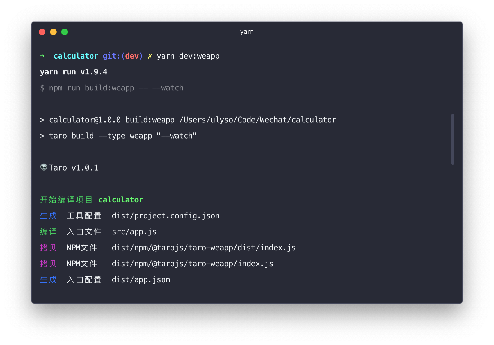

# hyper-nyx
a dark theme for hyper

[](https://github.com/nyx-theme/hyper-nyx)    [](https://github.com/nyx-theme/hyper-nyx)



## Installation

Just use hyper command below and then reload the hyper app:

```
hyper install hyper-nyx
```
